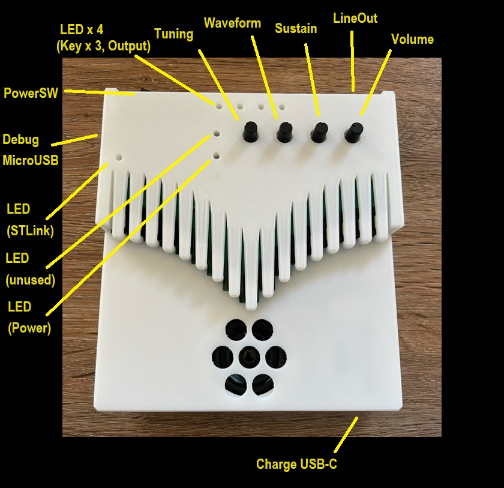
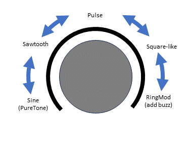
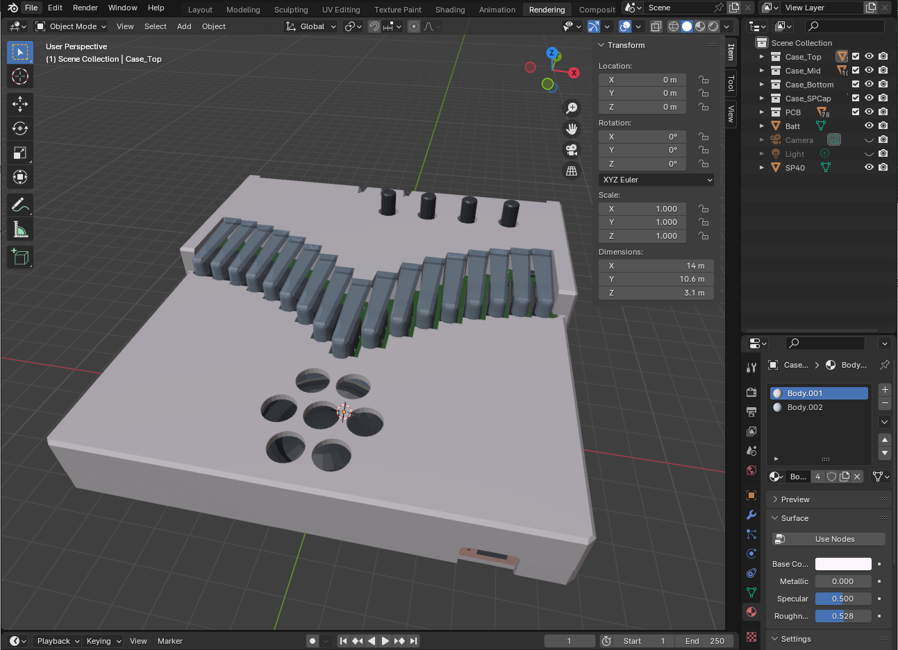
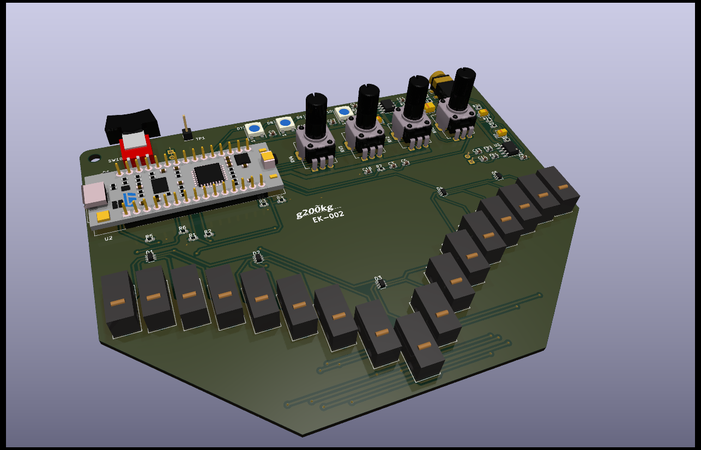
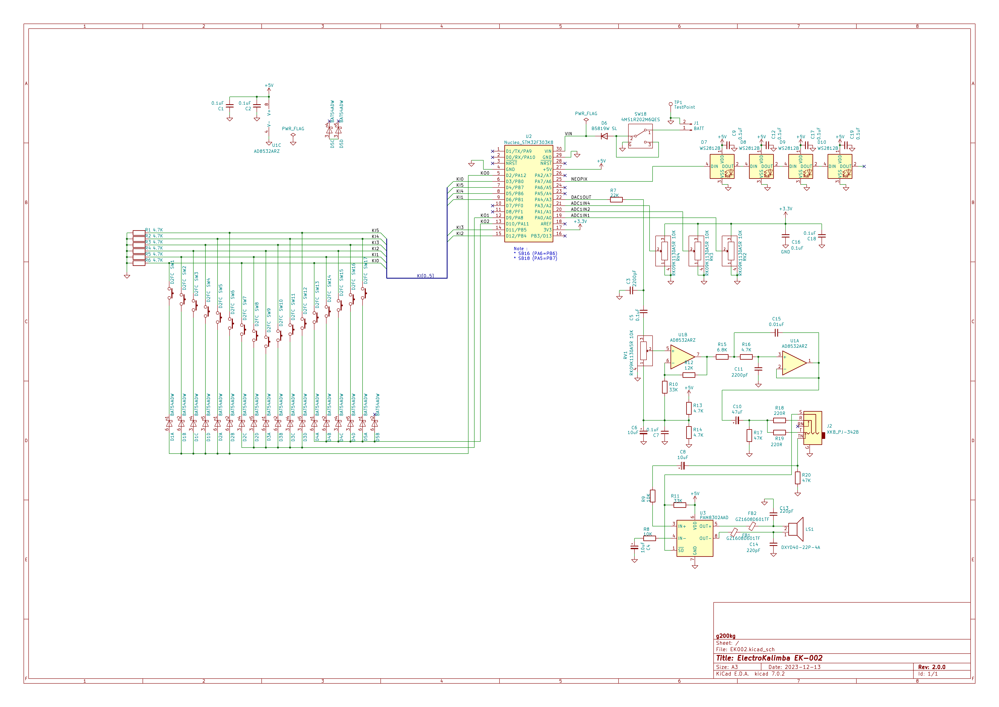
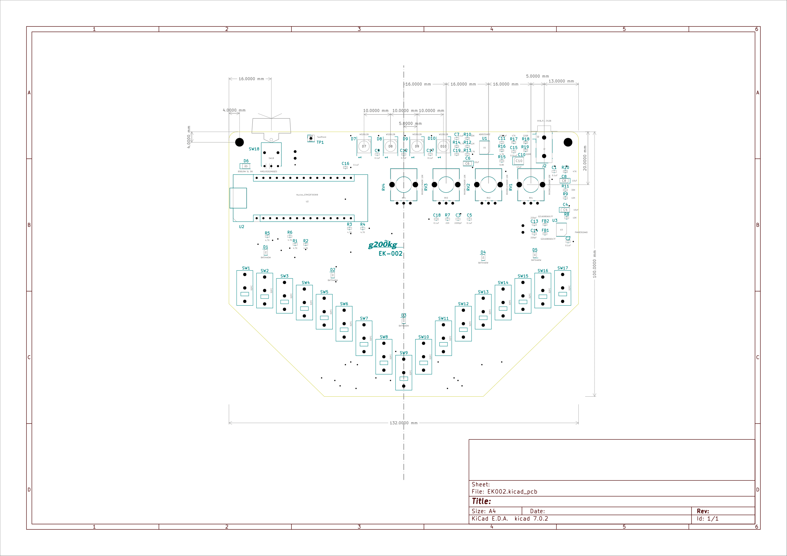

# electro-kalimba
ElectroKalimba EK-002

# Overview

これは楽器、"電子カリンバ" の設計データです。
回路図、ソフトウェアのソースコード、機構設計の 3D データを含みます。

## Usage

| 端子            | 説明                              |
|:---------------:|:---------------------------------:|
| Charge MicroUSB | 充電用 USB                        |
| Debug MicroUSB  | プログラム書き込み/デバッグ用 USB |
| Power Switch    | 電源スイッチ                      |
| Tuning          | チューニング                      |
| Waveform        | 音色設定　詳細は下の図            |
| Sustain         | サステイン　音の伸び方の設定      |
| Volume          | 音量設定                          |
| Line Out        | ライン出力                        |

## About Kalimba

カリンバはアフリカの民族楽器で、板の上に並んだ金属片を指ではじいて音を出す「親指ピアノ」などとも呼ばれるシンプルな楽器です。国や地方によって様々な様式や名前のものがありますが、現在一般的には 17 鍵のものが「カリンバ」として楽器の入門者向けとして流通しています。  

キーの配置は中心が一番低い音程になっていて左右交互に端に行くにしたがって高い音になっていきます。音程はピアノで言えば白鍵のみで黒鍵の半音に相当する鍵盤はありません。  

現在のカリンバは金属片が振動するほぼサイン波の澄んだオルゴールのような音が鳴りますが、元々のカリンバの使い方としては金属片に少し針金を巻きつけるなどによってジージーと鳴るノイズを加えたりします。

# Directories

以下のファイルが含まれています
  
  Blender - 機構設計データ - Blender 4.0.2  
  KiCad - 回路/基板設計データ - KiCad 7.0  
  STM32CubeIDE - ソフトウェア設計データ - STM32CubeIDE 1.13.2  

## Blender files

Blender ディレクトリには "Blender" 用の筐体の 3D データが収められています。
筐体として必要なのは次の4つのパーツになります。

* Case_Top : 鍵盤部と本体上部
* Case_Mid : 本体下部
* Case_Bottom : 底面
* Case_SPCap : スピーカー突起部のカバー

全てのパーツはサポートなし、あるいはほぼサポートなしで印刷できま\す。Case_Top、Case_Mid は印刷時には回転して上下を逆にしてください。
Creality K1 でブリム、ラフトなしで印刷を確認しています。

設計データ上は "cm" 単位で数値指定しています。印刷時に必要に応じてスケーリングしてください。

"*.stl" ファイルは各パーツを STL として書き出したもので、既にスケーリングされて "mm" 単位になっています。

3D プリンターは少なくとも 140 x 147 mm のサイズを造形できる必要があります。

  

## KiCad files

PDF 化した回路図 と KiCad 7.0.2 用のファイルです。

Schametic PDF and files for KiCad 7.0.2.

* EK002-pcb.pdf Schematic PDF.
* EK002.kicad_pro KiCad Project
* EK002.kicad_sch Kicad Schematic
* EK002.kicad_pcb Kicad Artwork

  
  

## STM32CubeIDE files

Files for STM32CubeIDE 1.13.2

* EK002.ioc  

STM32CubeIDE (STM32CubeMX) では STM32 のピンにペリフェラルの機能を割り当てる作業を GUI エディタで行う事ができ、*.ioc ファイルはそれに必要なデータです。

* main.c

処理の本体です。

### Software Environment

* 開発環境としてSTM32CubeIDE を用意してください。
  > [https://www.st.com/ja/development-tools/stm32cubeide.html](https://www.st.com/ja/development-tools/stm32cubeide.html)
* PC と EK002 の左上にあるデバッグ用 USB ポート (Micro USB) を接続してソフトウェアの書き込みができます。
* プロジェクトを作成するには、STM32CubeIDE の 'File' - 'New' - 'STM32Project from an existing STM32CubeMX Configuration file (*.ioc)' で `EK002.ioc` を選択してプロジェクトを新たに作成し、Core/Src/main.c をこの `main.c` で上書きしてしまうのが簡単だと思います。

---

* Prepare STM32CubeIDE as a development environment.
  > [https://www.st.com/ja/development-tools/stm32cubeide.html](https://www.st.com/ja/development-tools/stm32cubeide.html)
* Software can be written by connecting a PC to the debugging USB port (Micro USB) on the top left of EK002.
* To create a project, select `EK002.ioc` in 'File' - 'New' - 'STM32Project from an existing STM32CubeMX Configuration file (*.ioc)' in STM32CubeIDE, and create a new project. I think it is easy to overwrite /Src/main.c with this `main.c`.

### Pin Assign

STM32 の各ピンの使用状況は以下の通りです。

---

STM32 pins are used as follows.

| Port  | STM32 Pin | Nucleo Pin | Function             |
|:-----:|:---------:|:----------:|:--------------------:|
| PA_0  |     6     |     A0     | ADC1 IN1 (POT2)      |
| PA_1  |     7     |     A1     | ADC1 IN2 (POT3)      |
| PA_2  |     8     |     A7     | -                    |
| PA_3  |     8     |     A2     | ADC1 IN4 (POT4)      |
| PA_4  |    10     |     A3     | DAC1 OUT1 (AudioOut) |
| PA_5  |    11     |     A4     | -                    |
| PA_6  |    12     |     A5     | -                    |
| PA_7  |    13     |     A6     | TIM17 CH1            |
| PA_8  |    18     |     D9     | KeyScan Out 1        |
| PA_9  |    19     |   D1/TX    | -                    |
| PA_10 |    20     |   D0/RX    | -                    |
| PA_11 |    21     |    D10     | KeyScan Out 2        |
| PA_12 |    22     |     D2     | KeyScan Out 0        |
| PA_13 |    23     |      -     | (SWDIO)              |
| PA_14 |    24     |      -     | (SWCLK)              |
| PA_15 |    25     |      -     | -                    |
| PB_0  |    14     |     D3     | KeyScan In 0         |
| PB_1  |    15     |     D6     | KeyScan In 1         |
| PB_2  |     -     |      -     | -                    |
| PB_3  |    26     | D13(LED)   | -                    |
| PB_4  |    27     |    D12     | KeyScan In 2         |
| PB_5  |    28     |    D11     | KeyScan In 3         |
| PB_6  |    29     |     D5     | KeyScan In 4         |
| PB_7  |    30     |     D4     | KeyScan In 5         |
| PF_0  |     2     |     D7     | -                    |
| PF_1  |     3     |     D8     | -                    |

### Peripheral Assign

STM32 の タイマーや DMA 等のペリフェラルは以下のように使用されています。

---

Peripherals such as timers and DMA are used as follows.

| Timing  | Data Source    |   DMA    |Data Destination | 
|:-------:|:--------------:|:--------:|:---------------:|
| TIM6    | outBuff[]      | DMA1 Ch3 | DAC1 Ch1        |
| TIM7    | KeyScan        | -        | software        |
| TIM17   | neoPixelBuff[] | DMA1 Ch7 | NeoPixel LED    |
| -       | ADC1 Ch1/2/4   | DMA1_Ch1 | adcVal[]        |

### POT

POT1 は Volume ツマミとして回路的に固定されています。POT2-POT4 の 3 つは ADC (ADC1 Ch1/2/4) によって読み込まれソフトウェア的に処理されます。
読み込みは DMA (DMA1 Ch1) で行われ、常時、変数 `adcVal[]` に取り込まれています。

### Key Scan

鍵盤のスキャンは KeyScan Out 0-2 のどれか一つを出力した時の KeyScan In 0-5 の状態を読み込む事で行います。

### Generate

音声信号は波形テーブル `waveTabA` - `waveTabC` の 3つのテーブルと固定周波数のリングモジュレータの信号から生成します。WaveForm (adcVal[1]) のツマミの値で次のように信号のミックスが変わります。

waveTabA (pure Sin) => waveTabB (Sawtooth) => waveTabC (more harmonix) => ring mod

### Output

生成された音声信号はバッファ outBuff[] から DMA (DMA1 Ch3) によって DAC に常時送られます。DMA はバッファサイズの半分、および全部を送り終わった時に割り込みを発生しますので、割り込みの時点をトリガーにして送り終わった前半または後半のバッファを次の信号で埋めて行きます。

### NeoPixel

NeoPixel はシリアル信号で駆動するフルカラー LED です。ソフトウェアだけで制御信号のタイミングを作るのは困難ですのでタイマー (TIM17) の PWM 生成機能で
信号を作っています。`neoPixelBuff[]` には PWM のパルス幅を表すバイトデータの配列があり、DMA でタイマーに付随する PWM 発生機能に順次送る事により、4 つの NeoPixel LED を制御しています。

# License

このリポジトリのファイルは MIT ライセンスのもとに公開されています。

---

The files in this repository are released under the MIT license.
