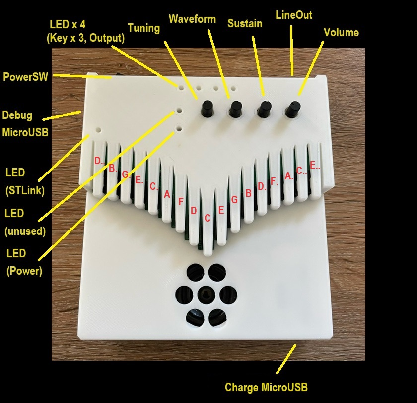
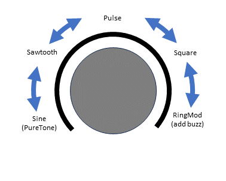

# electro-kalimba
ElectroKalimba EK-002

## About Kalimba

The kalimba is an African folk instrument. It is a simple instrument that is also called a "thumb piano" and produces sound by plucking metal pieces lined up on a board with your fingers. There are various styles and names depending on the country and region,  but the one with 17 keys is generally distributed as "kalimba" today.  

The keys are arranged so that the pitch is the lowest in the center, and the pitch becomes higher as you move toward the edges, alternating left and right. On the piano, there are only white keys, and there are no keys on the keyboard that correspond to the semitones of the black keys. 

The current kalimba produces a clear, almost sine-wave, music box-like sound from the vibrating metal pieces, but the original use of the kalimba was to add a jittery noise by wrapping a bit of wire around the metal pieces.

---

カリンバはアフリカの民族楽器で、板の上に並んだ金属片を指ではじいて音を出す「親指ピアノ」などとも呼ばれるシンプルな楽器です。国や地方によって様々な様式や名前のものがありますが、現在一般的には 17 鍵のものが「カリンバ」として流通しています。  

キーの配置は中心が一番低い音程になっていて左右交互に端に行くにしたがって高い音になっていきます。音程はピアノで言えば白鍵のみしかなく、黒鍵の半音に相当する鍵盤はありません。  

現在のカリンバは金属片が振動するほぼサイン波の澄んだオルゴールのような音が鳴りますが、元々のカリンバの使い方としては金属片に少し針金を巻きつけるなどによってジージーと鳴るノイズを加えたりします。

## Usage

This "ElectroKalimba" can be played like a normal kalimba, but while a normal kalimba makes a sound by flicking a key, this electronic kalimba makes a sound when you press a key, so the feeling of playing is slightly different.

If nothing is connected to the LineOut terminal, sound will be output from the built-in speaker. The built-in speaker is muted when the LineOut terminal is used. Connect a 2-pole (monaural) or 3-pole (stereo) mini plug to the LineOut terminal. If you connect a plug with 4 or more pins, it may not work properly.

The battery is rechargeable. Charging is done using the Charge MicroUSB terminal on the front of the main unit. The Debug MicroUSB at the top left of the main unit is the USB connector of the Nucleo board used internally, and is used when writing/debugging programs.

---

この ElectroKalimba は普通のカリンバのように演奏できますが、普通のカリンバがキーをはじいて音を出すのに対し、この電子カリンバはキーを押し込んだ時に音を出しますので、演奏の感覚は微妙に異なるかも知れません。

LineOut 端子に何も接続していない場合は内蔵スピーカーから音がでます。LineOut 端子使用時は内蔵スピーカーはミュートされます。LineOut 端子には 2 極(モノラル)または 3 極 (ステレオ) のミニプラグを接続してください。4 極以上のプラグを接続した場合は正常に動作しない場合があります。

電池は充電式です。充電は本体手前にある Charge MicroUSB 端子で行います。本体左上にある Debug MicroUSB は内部で使用している Nucleo ボードの USB コネクタで、プログラムの書き込み/デバッグを行う際に使用します。

| 端子            | 説明                              |
|:---------------:|:---------------------------------:|
| Charge MicroUSB | 充電用 USB                        |
| Debug MicroUSB  | プログラム書き込み/デバッグ用 USB |
| Power Switch    | 電源スイッチ                      |
| Tuning          | チューニング                      |
| Waveform        | 音色設定　詳細は下の図            |
| Sustain         | サステイン　音の伸び方の設定      |
| Volume          | 音量設定                          |
| Line Out        | ライン出力                        |

## Demo Movie  

https://youtu.be/vXB684UsEok  

# Repository

This repository contains design data for the musical instrument "ElectroKalimba".
Contains schematic, software source code, and 3D data of mechanical design.

---

このリポジトリは楽器、"電子カリンバ" の設計データです。
回路図、ソフトウェアのソースコード、機構設計の 3D データを含みます。

# Directories

Contains the following files  
  
   Blender - Mechanism design data - Blender 4.0.2  
   KiCad - Circuit/Board Design Data - KiCad 7.0  
   STM32CubeIDE - Software Design Data - STM32CubeIDE 1.13.2  

---

以下のファイルが含まれています
  
  Blender - 機構設計データ - Blender 4.0.2  
  KiCad - 回路/基板設計データ - KiCad 7.0  
  STM32CubeIDE - ソフトウェア設計データ - STM32CubeIDE 1.13.2  

## Blender files

The Blender directory contains 3D data for the "Blender" housing. The following four parts are required for the casing.  
  
Case_Top: Keyboard section and top of main body  
Case_Mid: Lower part of the main body  
Case_SP_Ring: Speaker front cover  
Case_Bottom: Bottom  
Case_SP_Cap: Speaker bottom cover  

All parts can be printed with no or very little support. When printing Case_Top, Case_Mid, and Case_SP_Ring, rotate them upside down. Printing confirmed with Creality K1 without brim or raft.  

In the design data, numerical values are specified in "cm" units. Please scale as necessary when printing.  

The "*.stl" file is an STL export of each part, already scaled to "mm" units.  

The 3D printer must be able to print at least 140 x 147 mm.  

---

Blender ディレクトリには "Blender" 用の筐体の 3D データが収められています。
筐体として必要なのは次の4つのパーツになります。

* Case_Top : 鍵盤部と本体上部
* Case_Mid : 本体下部
* Case_SP_Ring : スピーカー前面のカバー
* Case_Bottom : 底面
* Case_SP_Cap : スピーカー底部のカバー

全てのパーツはサポートなし、あるいはほぼサポートなしで印刷できま\す。Case_Top、Case_Mid、Case_SP_Ring は印刷時には回転して上下を逆にしてください。
Creality K1 でブリム、ラフトなしで印刷を確認しています。

設計データ上は "cm" 単位で数値指定しています。印刷時に必要に応じてスケーリングしてください。

"*.stl" ファイルは各パーツを STL として書き出したもので、既にスケーリングされて "mm" 単位になっています。

3D プリンターは少なくとも 140 x 147 mm のサイズを造形できる必要があります。

  

## KiCad files

PDF 化した回路図 と KiCad 7.0.2 用のファイルです。

---

Schametic PDF and files for KiCad 7.0.2.

* EK002-pcb.pdf Schematic PDF.
* EK002.kicad_sch Kicad Schematic
* EK002.kicad_pcb Kicad Artwork

  
  

## STM32CubeIDE files

Files for STM32CubeIDE 1.13.2

* EK002.ioc  

STM32CubeIDE (STM32CubeMX) allows you to assign peripheral functions to STM32 pins using a GUI editor, and *.ioc files are the data necessary for this.

---

STM32CubeIDE (STM32CubeMX) では STM32 のピンにペリフェラルの機能を割り当てる作業を GUI エディタで行う事ができ、*.ioc ファイルはそれに必要なデータです。

* main.c

This is the main body of the process.

---

処理の本体です。

### Software Environment

* Prepare STM32CubeIDE as a development environment.
   > [https://www.st.com/en/development-tools/stm32cubeide.html](https://www.st.com/en/development-tools/stm32cubeide.html)
* Software can be written by connecting a PC to the debugging USB port (Micro USB) on the top left of EK002.
* The target of the project is "Nucleo STM32F303K8". To create a project, select `EK002.ioc` in 'File' - 'New' - 'STM32Project from an existing STM32CubeMX Configuration file (*.ioc)' in STM32CubeIDE, and create a new project. I think it is easy to overwrite `Core/Src/main.c` with this `main.c`.
* Serial port can be used for `printf` debugging. Start the appropriate terminal software on the PC connected via USB and connect to STLink Virtual COM Port at 115200 bps.

---

* 開発環境として STM32CubeIDE を用意してください。
  > [https://www.st.com/ja/development-tools/stm32cubeide.html](https://www.st.com/ja/development-tools/stm32cubeide.html)
* PC と EK002 の左上にあるデバッグ用 USB ポート (Micro USB) を接続してソフトウェアの書き込みができます。
* プロジェクトのターゲットは "Nucleo STM32F303K8"　です。プロジェクトを作成するには、STM32CubeIDE の 'File' - 'New' - 'STM32Project from an existing STM32CubeMX Configuration file (*.ioc)' で `EK002.ioc` を選択してプロジェクトを新たに作成し、`Core/Src/main.c` をこの `main.c` で上書きしてしまうのが簡単だと思います。
* シリアルポートを `printf` デバッグ用に使用できます。USB を接続した PC で適当な端末ソフトを起動し、STLink Virtual COM Port に 115200 bps で接続してください。

### Pin Assign

The usage of each pin of STM32 is as follows. Note that some pins are connected to other pins and LEDs within his Nucleo board.

---

STM32 の各ピンの使用状況は以下の通りです。幾つかのピンは Nucleo ボード内で他のピンや LED に接続されている事に注意が必要です。

| Port  | STM32 Pin | Nucleo Pin | Function in EK-002        |
|:-----:|:---------:|:----------:|:-------------------------:|
| PA_0  |     6     |     A0     | ADC1 IN1 (POT2)           |
| PA_1  |     7     |     A1     | ADC1 IN2 (POT3)           |
| PA_2  |     8     |     A7     | -                         |
| PA_3  |     8     |     A2     | ADC1 IN4 (POT4)           |
| PA_4  |    10     |     A3     | DAC1 OUT1 (AudioOut)      |
| PA_5  |    11     |     A4(D5) | - (conn. to PB6 w/SB16)   |
| PA_6  |    12     |     A5(D4) | - (conn. to PB7 w/SB18)   |
| PA_7  |    13     |     A6     | TIM17 CH1                 |
| PA_8  |    18     |     D9     | KeyScan Out 1             |
| PA_9  |    19     |   D1/TX    | -                         |
| PA_10 |    20     |   D0/RX    | -                         |
| PA_11 |    21     |    D10     | KeyScan Out 2             |
| PA_12 |    22     |     D2     | KeyScan Out 0             |
| PA_13 |    23     |      -     | (SWDIO)                   |
| PA_14 |    24     |      -     | (SWCLK)                   |
| PA_15 |    25     |      -     | -                         |
| PB_0  |    14     |     D3     | KeyScan In 0              |
| PB_1  |    15     |     D6     | KeyScan In 1              |
| PB_2  |     -     |      -     | -                         |
| PB_3  |    26     |   D13(LED) | -                         |
| PB_4  |    27     |    D12     | KeyScan In 2              |
| PB_5  |    28     |    D11     | KeyScan In 3              |
| PB_6  |    29     |   D5(A4)   | KeyScan In 4  (PA5 w/SB16)|
| PB_7  |    30     |   D4(A5)   | KeyScan In 5  (PA6 w/SB18)|
| PF_0  |     2     |     D7     | -                         |
| PF_1  |     3     |     D8     | -                         |

### Peripheral Assign

Peripherals such as Timers and DMA are used as follows.

---

STM32 の タイマーや DMA 等のペリフェラルは以下のように使用されています。

| Timing  | Data Source    |   DMA    |Data Destination | 
|:-------:|:--------------:|:--------:|:---------------:|
| TIM6    | outBuff[]      | DMA1 Ch3 | DAC1 Ch1        |
| TIM7    | KeyScan        | -        | software        |
| TIM17   | neoPixelBuff[] | DMA1 Ch7 | NeoPixel LED    |
| -       | ADC1 Ch1/2/4   | DMA1_Ch1 | adcVal[]        |

### POT

POT1 is fixed in the circuit as the Volume knob. The three POT2-POT4 are read by ADC (ADC1 Ch1/2/4) and processed by software.
Reading is done by DMA (DMA1 Ch1) and is always stored in the variable `adcVal[]`.

---

POT1 は Volume ツマミとして回路的に固定されています。POT2-POT4 の 3 つは ADC (ADC1 Ch1/2/4) によって読み込まれソフトウェア的に処理されます。
読み込みは DMA (DMA1 Ch1) で行われ、常時、変数 `adcVal[]` に取り込まれています。

### Key Scan

Keyboard scanning is performed by reading the state of KeyScan In 0-5 when any one of KeyScan Out 0-2 is output.

---

鍵盤のスキャンは KeyScan Out 0-2 のどれか一つを出力した時の KeyScan In 0-5 の状態を読み込む事で行います。

### Generate

Signal generation is done with the `generate()` function, which fills half the size (first or second half) of `outBuff[]` in one call.

The number of voices that can be played simultaneously is 4. The pressed key is assigned to an empty (or less important) voice. Also, when assigning a new sound to a voice that is currently sounding, reduce the volume of the voice that is currently sounding before assigning it to avoid noise.

The audio signal is generated by mixing the four waveform tables `waveTabA` - `waveTabD` and the fixed frequency ring modulator signal. The signal mix changes as follows depending on the value of the Waveform (adcVal[1]) knob.

---

信号の生成は `generate()` 関数で行い、1回の呼び出しで `outBuff[]` の半分のサイズ (前半または後半) を埋めます。

同時発音可能なボイス数は 4 です。押された鍵盤から空いている (または重要度の低い) ボイスに割り当てています。 また、現在発音中のボイスに新たな音を割り当てる際にはノイズを発生させないように発音中のボイスの音量を絞ってから割り当てるようにします。

音声信号は波形テーブル `waveTabA` - `waveTabD` の 4つのテーブルと固定周波数のリングモジュレータの信号をミックスして生成します。Waveform (adcVal[1]) のツマミの値で次のように信号のミックスが変わります。

| Waveform | 説明                                            |
|:--------:|:-----------------------------------------------:|
|     0 => 1024 | waveTabA (Sine) => waveTabB (Sawtooth)     |
|  1024 => 2048 | waveTabB (Sawtooth) => waveTabC (Pulse)    |
|  2048 => 3072 | waveTabC (Pulse) => waveTabD (Square)      |
|  3072 => 4096 | waveTabD (Square) => RingMod               |

waveTabA (pure Sin) => waveTabB (Sawtooth) => waveTabC (Pulse) => => waveTabD (Square) => ring mod

各テーブルは次のような波形になっています。

またエンベロープは envTab[] が表すカーブに従って発音開始から音量が下がっていきます。

### Output

The generated audio signal is constantly sent to the DAC from the buffer outBuff[] by DMA (DMA1 Ch3). DMA generates an interrupt when half or all of the buffer size has been sent, so the interrupt is used as a trigger to fill the first or second half of the buffer with the next signal.

---

生成された音声信号はバッファ outBuff[] から DMA (DMA1 Ch3) によって DAC に常時送られます。DMA はバッファサイズの半分、および全部を送り終わった時に割り込みを発生しますので、割り込みの時点をトリガーにして送り終わった前半または後半のバッファを次の信号で埋めて行きます。

### NeoPixel

NeoPixel is a full color LED driven by a serial signal. It is difficult to create the timing of the control signal with software alone, so we use the PWM generation function of the timer (TIM17).
creating a signal. `neoPixelBuff[]` has an array of byte data representing the PWM pulse width, and it controls the four NeoPixel LEDs by sequentially sending it to the PWM generation function attached to the timer using DMA.

---

NeoPixel はシリアル信号で駆動するフルカラー LED です。ソフトウェアだけで制御信号のタイミングを作るのは困難ですのでタイマー (TIM17) の PWM 生成機能で
信号を作っています。`neoPixelBuff[]` には PWM のパルス幅を表すバイトデータの配列があり、DMA でタイマーに付随する PWM 発生機能に順次送る事により、4 つの NeoPixel LED を制御しています。

### Actual Current Consumption Test

800mAh 9V 電池使用時の電流測定と動作時間見積

| Current      | Condition          | Estimated operating time (800mAh Batt) |  
|:------------:|:------------------:|:------------------------:|
| 80mA - 100mA | Lineout            | 10h - 8h                 |
| 90mA - 120mA | Speaker Voluem Max | 8.9h -  6.7h             |

# License

The files in this repository are released under the MIT license.

---

このリポジトリのファイルは MIT ライセンスのもとに公開されています。

