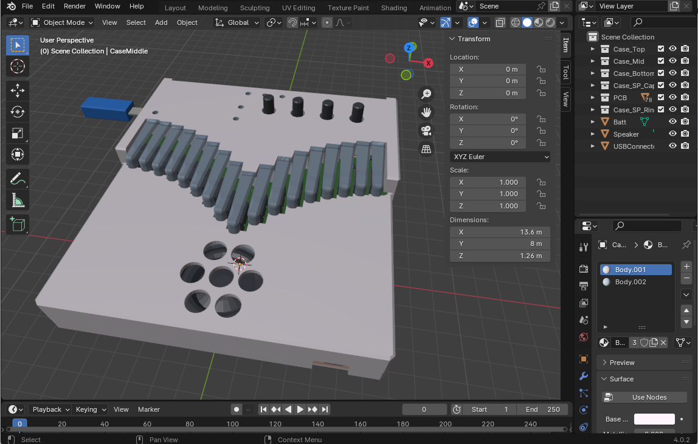
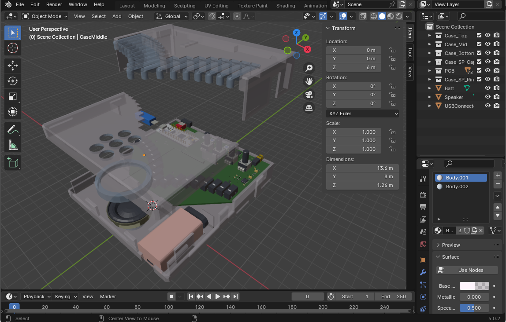

# electro-kalimba
ElectroKalimba EK-002

# Overview

これは電子カリンバという楽器の設計データです。
回路図、基板のガーバーデータ、ソフトウェアのソースコード、機構設計の 3D データを含みます。

カリンバはアフリカの民族楽器で、板の上に並んだ金属片を指ではじいて音を出す「親指ピアノ」などとも呼ばれるシンプルな楽器です。国や地方によって様々な様式や名前のものがありますが、現在一般的には 17 鍵のものが「カリンバ」として楽器の入門者向けとして流通しています。  

キーの配置は中心が一番低い音程になっていて左右交互に端に行くにしたがって高い音になっていきます。音程はピアノで言えば白鍵のみで黒鍵の半音に相当する鍵盤はありません。  

現在のカリンバは金属片が振動するほぼサイン波の澄んだオルゴールのような音が鳴りますが、元々のカリンバの使い方としては金属片に少し針金を巻きつけるなどによってジージーと鳴るノイズを加えたりします。

-----

This is design data for a musical instrument called an electronic kalimba.
Includes schematics, Gerber data of the board, software source code, and 3D data of the mechanism design.

The kalimba is an African folk instrument. It is a simple instrument that is also called a 'thumb piano' and produces sound by plucking metal pieces lined up on a board with your fingers. There are various styles and names depending on the country and region, but his 17-key version is currently popular as the 'kalimba' for beginners.

The keys are arranged so that the pitch is the lowest in the center, and the pitch becomes higher as you move toward the edges, alternating left and right. In terms of pitches on the piano, there are only the white keys, and there are no keys that correspond to the semitones of the black keys.

Modern kalimba's metal pieces vibrate to produce a clear music box-like sound with almost sine waves, but the original use of kalimba was to add a buzzing noise by wrapping a bit of wire around the metal piece.

# Directories

Blender - Mechanical Design - Blender 4.0.2  
KiCad - Schematic/PCB Design - KiCad 7.0  
STM32CubeIDE - Software Design - STM32CubeIDE 1.13.2  

## Blender files

Blender ディレクトリには "Blender" 用の筐体の 3D データが収められています。

* Case_Top: 鍵盤部と上部カバー
* Case_Mid: 本体部
* Case_Bottom: 底面蓋
* Case_SPCap: スピーカー突起部のカバー

Case_Top と Case_Mid は上下逆にしてほぼサポートなしで印刷できます。
Creality K1 でブリム、ラフトなしで印刷を確認しています。

"EK002.blend" is the content of the 3D data, and the following four parts are required for the casing. The data is created in "cm" units, so please scale it 10 times to handle data in "mm" units when outputting with a 3D printer.

* Case_Top: Keyboard part at the top of the case
* Case_Mid: Body part of the casing
* Case_Bottom: Bottom lid part
* Case_SPCap: The protruding part of the speaker on the bottom

The "*.stl" files are 3D shapes with each part separated and already scaled by 10 times.

To print on a 3D printer, it must be able to print at least 140 x 146 mm.

  

## KiCad files

PDF 化した回路図 と KiCad 7.0.2 用のファイルです。

Schametic PDF and files for KiCad 7.0.2.

* EK002-pcb.pdf Schematic PDF.
* EK002.kicad_pro KiCad Project
* EK002.kicad_sch Kicad Schematic
* EK002.kicad_pcb Kicad Artwork

  
  

## STM32CubeIDE files

Files for STM32CubeIDE 1.13.2

STM32CubeIDE (STM32CubeMX) では STM32 のピンにペリフェラルの機能を割り当てる作業を GUI エディタで行う事ができ、*.ioc ファイルはそれに必要なデータです。

